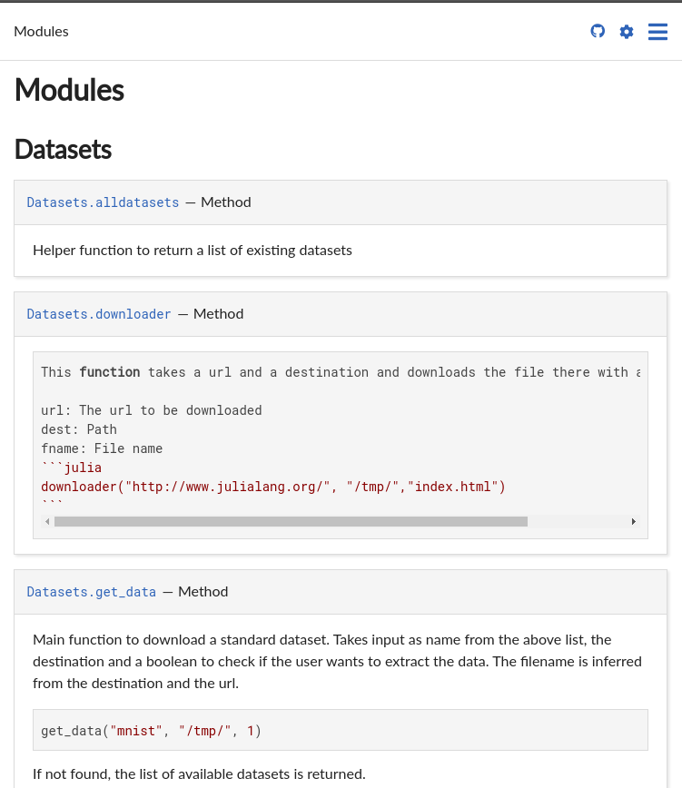

# Quickstart!

This page serves as a quickstart guide and it will get you up and running with whatever you need to start documenting YourAwesomePackage.jl . Do refer to the rest of the documentation if you want to make use of the entire feature set :)

## What are we trying to do?

This



## How 

1. Toml who? This is very generic to Julia and you can get it by going to your folder, opening Julia and typing these. [Source](https://invenia.github.io/PkgTemplates.jl/stable/user/)

    ```jl
    ]add PkgTemplates
    using PkgTemplates
    t = Template()
    t("MyPkg")    
    ```
This will create a bunch of default folders which we will use.
> Note that PkgTemplates can [generate the documentation for you](https://invenia.github.io/PkgTemplates.jl/stable/user/#PkgTemplates.Documenter). It requires a bit of tinkering but you can skip a few steps if you want. (Go to step 8 directly :) )
2. Get the package
   ```jl
   ]add Documenter
   ```
3. Put your code in the folder called src
4. Create a folder called docs
    - Follow this structure if you can (most of this is auto generated)
      - DDL.jl
        - src
          - DDL.jl
          - classif.jl
        - docs
        - tests
        - README.md
        - Manifest.toml
        - Project.toml
5. Now in the docs folder make this heirarchy
    - docs
      - make.jl
      - src
      - Project.toml (To take care of related dependencies)

        >Tip: If you have a clean repo you can do this to speed up your workflow

        ```jl
        $ julia --project=docs/
        pkg> instantiate
        pkg> dev .
        julia> include("docs/make.jl")
        ```

6. Inside the make.jl file, take this and modify it for your purpose.
    - ```jl
        using Documenter, classification, Datasets

        Documenter.makedocs(
            sitename = "DDL Documentation",
            repo = "https://github.com/SubhadityaMukherjee/DDL.jl"
        )
    ```
    - Instead of classification and Datasets, put the names of the other files you have in your source
    - Note that this is a very basic initialization and more complex ones can be found in their [documentation](https://juliadocs.github.io/Documenter.jl/stable/man/guide/#Navigation)
7. After that, go to the docs folder and do 

    ```jl
    julia make.jl
    ```
8. This will generate everything you need. You can test it out by opening docs/build/index.html
9. To add content, go to docs/src/index.md and type whatever you need in markdown
10. The coolest thing is how to auto add documentation from your code. 
    - Suppose you have something like this 
    ```jl
    """
    - Takes paths generated from load_classes as input
    - Takes a function defining a custom label
    - eg: labeller(x) = split(x, "/")[-1]
    - Returns labels based on function specified
    """
    function labelFromPattern(paths, labeller)
        labeller.(paths)
    end
    ``` 
    - Format all your docs to be this way
    - Then go to index.md and add this block
    ```md
    ```@autodocs
    Modules = [modulename]
    `` ` 
    ```
    - If you have done every step correctly, this should automatically get your documentation here
    - Style it or add whatever you want
    - When you are done, run the make.jl file once more
11. If you want to host this on github, upload the repo first
12. Then go to github.com/username/reponame
13. Go to settings and then scroll down till you find "Github Pages". Click publish and choose the gh-pages branch (Make a branch if you do not have one. It would save hassle later.) 
14. Done! To access your site go to username.github.io/projectname/build/index.html
15. You can also mess around with the paths if you know how to. Or add extra features. But this will get you set up with all the needed basics!

## Tips and informal rules

1. Write docstrings as you go. Because you will never feel like writing them later
2. No need to write paragraphs, just explain what to do and how to invoke the function
3. Be short and to the point
4. If possible, include an example too. 
    This function takes a url and a destination and downloads the file there with a name specified.
    ```md
    url: The url to be downloaded
    dest: Path
    fname: File name
    ```julia
    downloader("http://www.julialang.org/", "/tmp/","index. html")```
    ```
5. Learn *markdown* 

It will save your life over and over again.
Here is the best cheat sheet I found to learn it [CHEAT](https://github.com/adam-p/markdown-here/wiki/Markdown-Cheatsheet)

6. *Automation!*

If you want to automate this workflow, use a [github action](https://discourse.julialang.org/t/step-by-step-documentation-tutorial/46093/4)


> This was previously published in [Link](https://www.subhadityamukherjee.me/2020/09/04/Documentation.html)
