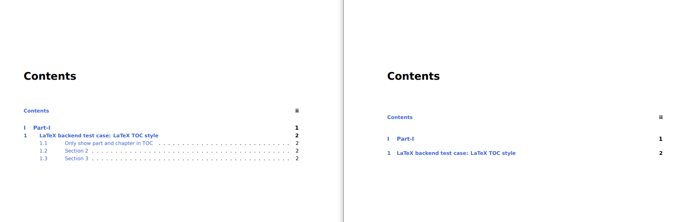

# LaTeX backend test case: LaTeX TOC style


With the default settings of `Documenter.jl`, the section name will be displayed in the TOC.

```tex
%% TOC settings
% -- TOC depth
%   value: [part, chapter, section, subsection,
%           subsubsection, paragraph, subparagraph]
\settocdepth{section}  % show "part+chapter+section" in TOC
```

You can modify settings that related to the TOC format by add customized `preamble.tex`.

## Only show part and chapter in TOC

```tex
\settocdepth{part}  % show "part+chapter" in TOC
```

## Default style vs. custom style

Left side: default style, show "part+chapter+section" in TOC.

Right side: custom style, show "part+chapter" in TOC.


